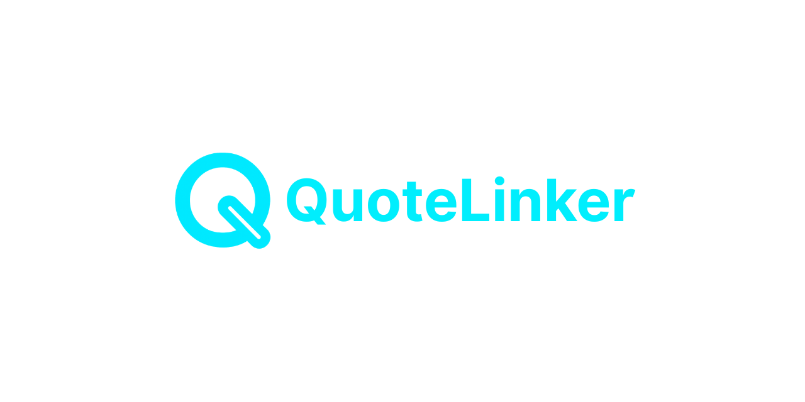

# QuoteLinker

<div align="center">
  
  
  [](https://nextjs.org)
  [](https://www.typescriptlang.org)
  [](https://tailwindcss.com)
  [](https://vercel.com)
  [](LICENSE)
</div>

## 🎯 The Problem

Insurance agents and licensed insurance producers face two major challenges in acquiring new business in the digital era:

1. **Overpriced Leads**: Paying $50-100 per lead that is unlikely to convert
2. **Low Intent**: Receiving leads from users who aren't serious about buying insurance which lowers closing KPIs

Consumers struggle with:

1. **Complex Process**: Lengthy forms and multiple agent calls
2. **Uncertainty**: Not knowing if they're getting the best rates
3. **Spam**: Getting bombarded with calls from multiple agents

## 💡 The Solution

QuoteLinker is a modern platform that connects consumers with local, licensed insurance agents through a streamlined quote process. We solve the problems on both sides:

### For Insurance Agents

- **Exclusive Leads**: Get first access to high-intent leads in your area
- **Performance Tracking**: Real-time analytics on lead quality and conversion
- **No Spam**: Leads are distributed to one agent at a time
- **Cost-Effective**: Pay only for qualified leads that match your expertise

### For Consumers

- **Simple Process**: One form, multiple quotes from local agents
- **Quality Matches**: Connect with licensed agents in your area
- **No Spam**: Your information is shared with one agent at a time
- **Better Rates**: Compare quotes from multiple providers

## 🚀 How It Works

1. **Consumer Journey**:
   - Fill out a simple form with basic information
   - Get matched with local, licensed agents
   - Receive personalized quotes
   - Choose the best option for your needs

2. **Agent Journey**:
   - Receive qualified leads in your area
   - Access detailed lead information
   - Self-service dashboard
   - Track performance and ROI


## 🛠️ Technical Overview

QuoteLinker leverages technology to deliver a seamless experience:

- **Framework**: Next.js 14 with App Router
- **Language**: TypeScript for type safety
- **Styling**: Tailwind CSS for responsive design
- **Forms**: Advanced form handling with validation
- **Analytics**: Comprehensive tracking and insights
- **Deployment**: Enterprise-grade infrastructure

## 🚀 Getting Started

### Prerequisites

- Node.js 20.x
- npm 10.x

### Installation

```bash
# Clone the repository
git clone https://github.com/QuoteLinker/quote-linker-web.git
cd quote-linker-web

# Install dependencies
npm install

# Set up environment variables
cp .env.example .env.local
# Edit .env.local with your configuration

# Start development server
npm run dev
```

### Development Workflow

- **Linting**: `npm run lint`
- **Formatting**: `npm run format`
- **Testing**: `npm run test`
- **Type Checking**: `npm run type-check`

## 📈 Roadmap

- [ ] Enhanced lead scoring system
- [ ] Real-time agent-consumer communication
- [ ] Mobile app for agents and consumers
- [ ] Automated quote comparison
- [ ] Integration with major carriers

## 🤝 Contributing

We welcome contributions! Please see our [Contributing Guidelines](CONTRIBUTING.md) for details.

1. Fork the repository
2. Create your feature branch (`git checkout -b feature/amazing-feature`)
3. Commit your changes (`git commit -m 'Add some amazing feature'`)
4. Push to the branch (`git push origin feature/amazing-feature`)
5. Open a Pull Request

## 📄 License

This software is proprietary and confidential. Unauthorized copying, transferring, or reproduction of the contents of this software, via any medium, is strictly prohibited.

Copyright © 2025 QuoteLinker. All rights reserved.

## 🌐 Links

- [Live Website](https://quotelinker.com)
- [YouTube Channel](https://youtube.com/@quotelinker)
- [LinkedIn Page](https://linkedin.com/company/quotelinker)

## 🔧 Technology

QuoteLinker is built with modern web technologies and leverages AI-powered optimizations to deliver the best possible experience for both consumers and agents. Our technology stack is carefully chosen to ensure reliability, performance, and scalability.

## ⚠️ Important Notice

This repository contains proprietary code and business logic. All rights reserved. The codebase includes AI-enhanced features and optimizations that are core to our competitive advantage.
